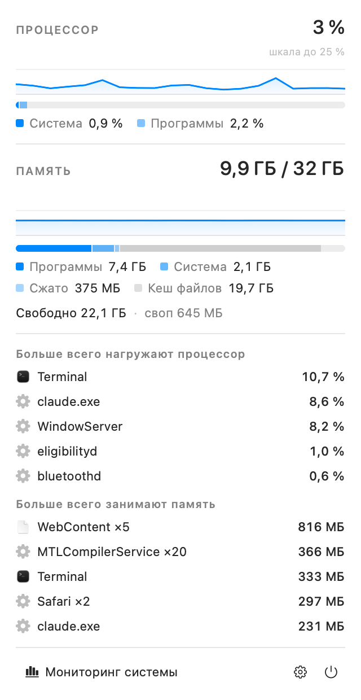

<h1 align="center">ResBar</h1>

<p align="center">
  Монитор процессора и памяти в строке меню macOS.<br>
  Цифры всегда рядом с часами, подробности — по щелчку.
</p>

<p align="center">
  
  
  
  
</p>

```
… 🔋  12% · 22,5 ГБ   Пт 14:32
```

<p align="center">
  <picture>
    <source media="(prefers-color-scheme: dark)" srcset="docs/panel-dark.png">
    
  </picture>
</p>

## Что умеет

- **Загрузка процессора и память в строке меню** — одним взглядом, не открывая окон.
- **Панель с подробностями:** из чего складывается занятая память, история нагрузки
  за последние минуты, своп и уровень нагрузки на память, когда он перестал быть нормальным.
- **Топ-5 процессов** по процессору и по памяти. Одноимённые сводятся в строку вида
  «WebContent ×5»: браузеры порождают их десятками, и список из одинаковых имён
  ничего бы не сказал.
- **Считает как Мониторинг системы:** занятая память — это программы + системная + сжатая,
  а загрузка процессора — разница счётчиков между двумя опросами, а не среднее
  за всё время работы процесса.
- **Почти ничего не тратит сам:** 10 МБ и 0,06 % одного ядра, пока панель закрыта.
  Опрос останавливается, когда дисплей уходит спать.
- **Собирается без Xcode** — хватает Command Line Tools.

Интерфейс приложения на русском языке.

## Установка

```bash
git clone https://github.com/kirivandubai/mac_widget_res.git
cd mac_widget_res
./build.sh --install
```

Скрипт соберёт приложение, положит его в `/Applications` и запустит — значок появится
в строке меню слева от часов. Чтобы просто собрать, не устанавливая:

```bash
./build.sh          # результат: build/ResBar.app
```

**Требуется** macOS 14 Sonoma или новее и Command Line Tools (`xcode-select --install`).
Сборка идёт под архитектуру вашей машины: отдельных вариантов для Apple Silicon и Intel
делать не нужно.

**При первом запуске** macOS предупредит, что приложение от неизвестного разработчика:
оно подписано локальной подписью, а не сертификатом Apple. Разрешить запуск можно
в «Системных настройках» → «Конфиденциальность и безопасность», кнопкой
«Всё равно открыть». Это делается один раз.

## Как пользоваться

| Действие | Что происходит |
| --- | --- |
| Щелчок по значку | Раскрывается панель с подробностями |
| Правый щелчок | Сразу меню настроек |
| Шестерёнка в панели | То же меню настроек |
| `Esc` или щелчок мимо | Панель закрывается |

В настройках: частота обновления (1 / 2 / 5 секунд) — она задаёт ритм и надписи,
и панели целиком; что показывать в строке меню (процессор и память, только процессор,
только память); какое число выводить для памяти — свободную или занятую; автозапуск
при входе в систему.

Автозапуск macOS требует подтвердить: после включения система показывает пункт
в «Системных настройках» → «Основные» → «Объекты входа», и приложение предложит
открыть этот раздел. Пока подтверждения нет, автозапуск не сработает.

Переключается он и из терминала:

```bash
/Applications/ResBar.app/Contents/MacOS/ResBar --enable-login-item
/Applications/ResBar.app/Contents/MacOS/ResBar --disable-login-item
```

## Что означают цифры

**Процессор.** Мгновенная загрузка, посчитанная как разница счётчиков процессорного
времени между двумя опросами — то же, что показывает `top`. «Система» — работа ядра
и системных служб, «Программы» — пользовательский код. Шкала графика подстраивается
под наблюдаемые значения (потолок 25 %, 50 % или 100 % — он подписан в углу), иначе
при обычной фоновой нагрузке линия была бы прижата к нулю и ничего не показывала.

**Память.** График памяти, в отличие от графика процессора, всегда показывает долю
от всего объёма — так он читается заодно с полосой под ним. Занятая память считается
как в Мониторинге системы: программы + системная (wired) + сжатая. Кеш файлов в неё
не входит — он занят данными с диска и освобождается по первому требованию, поэтому
«свободно» учитывает его как доступную память. Своп показывается, только когда
он используется.

**Процессы.** Загрузка считается по разнице накопленного процессорного времени,
то есть это текущее потребление, а не среднее за время жизни процесса. Значение может
быть больше 100 %: это доля от одного ядра, и процесс с несколькими потоками
занимает больше.

Данные о своих процессах приложение получает напрямую от ядра. Процессы других
пользователей (в первую очередь системные, запущенные от root) ядро без дополнительных
прав не отдаёт, поэтому они добираются через `ps`. Этот вызов заметно дороже, поэтому
список процессов собирается, только пока панель открыта.

## Сколько потребляет сам

| Состояние | Процессор | Память | Пробуждений в секунду |
| --- | --- | --- | --- |
| Панель закрыта | 0,06 % ядра | 10 МБ | 1,9 |
| Панель открыта | 0,8 % ядра | 20 МБ | 5,1 |

Один цикл замера процессора и памяти стоит 2 мкс. Решения, от которых зависят эти
цифры, легко потерять при доработках:

- **Надпись у часов рисуется отдельным слоем, а не через `attributedTitle` кнопки.**
  Штатный путь на каждое обновление заново размечает и перерисовывает кнопку целиком:
  0,18 % ядра против 0,06 % и вчетверо больше пробуждений. Надпись меняется постоянно,
  и это оказалось самой дорогой частью приложения — дороже самих замеров в сотни раз.
- **Панель создаётся при открытии и освобождается при закрытии.** Пока она жила
  постоянно, SwiftUI пересчитывал её на каждое обновление метрик: 81 МБ и 1,85 % ядра
  вместо 10 МБ, и 8000 пробуждений за 45 секунд вместо 180.
- **Полосы долей меняются мгновенно, без плавного перехода.** Четверть секунды покадровой
  отрисовки на каждое обновление стоили почти половину всего, что приложение тратит
  с открытой панелью: 2,3 % ядра против 1,3 %.
- **Графики нарисованы через `Shape`, а не `Canvas`.** Графический контекст SwiftUI
  держит собственный буфер отрисовки: два графика на `Canvas` стоили 65 МБ.
- **Секции панели — самостоятельные представления.** Пока они были частями одного тела,
  обновление списка процессов заставляло SwiftUI заново собирать и графики.
- **Тики процессора берутся сразу сложенными по всем ядрам** (`host_statistics`).
  Разбивка по ядрам нигде не показывается, а `host_processor_info` ради неё выделяет
  память в ядре: 5,5 мкс против 0,4.
- **`ps` вызывается примерно раз в пять секунд и только при открытой панели** — он
  занимает около 80 мс, тогда как данные о своих процессах ядро отдаёт за 2 мс.

## Устройство

| Файл | Назначение |
| --- | --- |
| `Sources/Metrics.swift` | Загрузка процессора и состояние памяти (mach, sysctl) |
| `Sources/ProcessList.swift` | Потребление ресурсов по процессам |
| `Sources/MetricsStore.swift` | Опрос по таймеру, группировка процессов, история |
| `Sources/PanelView.swift` | Панель на SwiftUI |
| `Sources/StatusItemController.swift` | Значок в строке меню и раскрытие панели |
| `Sources/PanelWindow.swift` | Окно панели и его размещение на экране |
| `Sources/SettingsMenu.swift` | Меню настроек |
| `Sources/Settings.swift` | Настройки, сохраняемые в UserDefaults |
| `Sources/Formatting.swift` | Форматирование чисел и надписи в строке меню |
| `Sources/LoginItem.swift` | Автозапуск при входе в систему |
| `Tools/MakeIcon.swift` | Рисует иконку приложения при сборке |
| `Tools/SelfCheck/` | Самопроверка метрик (`./check.sh`) |
| `Tools/Preview/` | Отрисовка панели в PNG (`./preview.sh`) |

Панель показывается собственным окном, а не `NSPopover`: popover привязывается к кнопке
в строке меню неверно и уезжает верхним краем под вырез экрана. Положение считается
явно от `visibleFrame`, поэтому панель всегда начинается сразу под строкой меню
и целиком помещается на экране.

Посмотреть на вёрстку панели, не запуская приложение:

```bash
./preview.sh                # build/panel-light.png и build/panel-dark.png
```

## Самопроверка

```bash
./check.sh
```

Сверяет вычисленные метрики с показаниями `top`, проверяет разбор данных, форматирование
и геометрию панели, а затем меряет контрольную нагрузку: скрипт занимает ровно одно ядро
и убеждается, что приложение показывает для него 100 %. Последняя проверка не декоративная —
именно она поймала, что `proc_pid_rusage` на Apple Silicon отдаёт время в тактах mach,
а не в наносекундах, из-за чего загрузка процессов была занижена в 41 раз.

## Удаление

```bash
osascript -e 'quit app "ResBar"'
rm -rf /Applications/ResBar.app
defaults delete com.ishtadeva.ResBar
```

Если был включён автозапуск, выключите его в настройках приложения до удаления.
